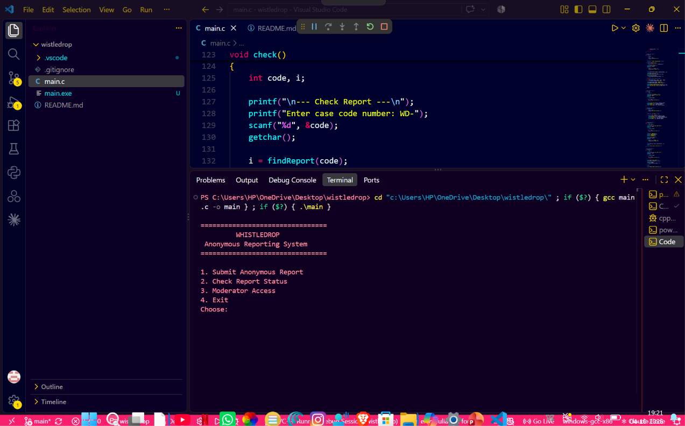
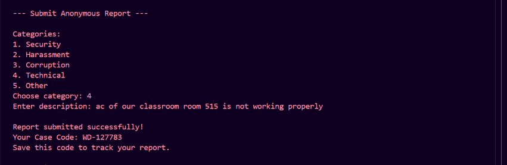

# WhistleDrop

### Anonymous Reporting System in C

WhistleDrop is a simple C program for submitting anonymous reports and checking their status using a case code.

## Demo





## Features

- Anonymous reports
- Case code generation
- Check report status
- Moderator login
- Update report status
- File storage

## Concepts Used

- C
- Structures
- Arrays
- Functions
- File handling

## How to Run

```bash
gcc main.c -o whistledrop